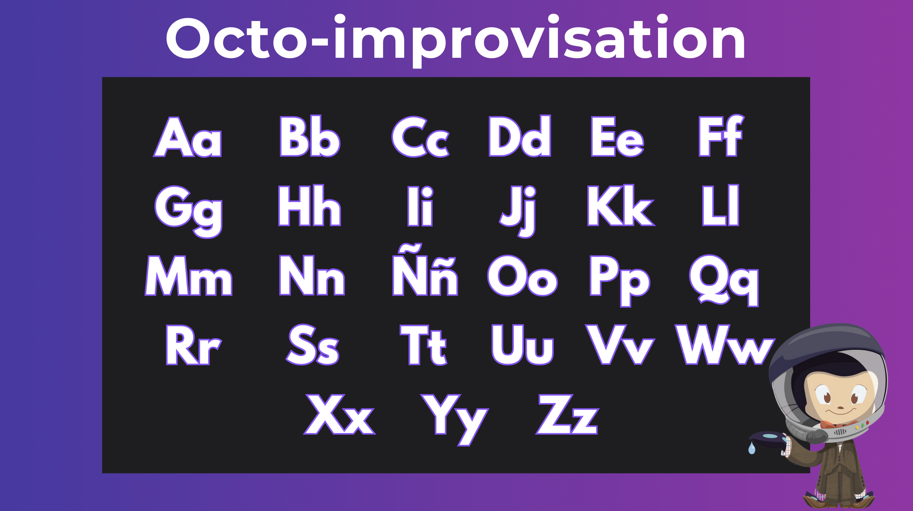

# Octo-trivia

_La actividad consiste en que las y los participantes ..._
<!-->Fomentar los conocimientos de la sesión en los participantes con una dinámica divertida encontrando patrones<-->

## Participantes

La actividad esta diseñada para **P** participantes.

- Equipos: _**M**_
- Participantes por equipo: _**N**_
- Nombre Equipo: _**X**_

## Instrucciones

_Se detallarán los pasos a seguir_
<!-->
Se plantearán una serie de preguntas sobre la temática del evento
Las respuestas correctas formarán un patrón de emojis [❤️🦖👀🐸🌲]
n preguntas: Cada pregunta mostrará 4 opciones de emojis (respuestas)
Respuesta: Se generará un template en Discussions para que los participantes coloquen sus respuestas de manera adecuada según el formato establecido (lista o tabla)
Respuestas correctas: Los participantes seleccionarán un emoji y lo agregarán en el template en su mismo comentario. En cada respuesta, los participantes van a crear su propio patrón.
IMPORTANTE: NO DEBEN ENVIAR SU RESPUESTA hasta que se hayan mostrado todas las preguntas.
El total de respuestas correctas formará un patrón único que será el indicador para ganar la trivia.
<-->

1. 
2. 
3. 

## Reglas

_Para el correcto funcionamiento de la actividad, se deben seguir las siguientes reglas:_

1. 
2. 
3. 

**FALTAS**

> [!IMPORTANT]  
> Será considerado "falta" si los participantes: Usa palabras ofensivas o despectivas ...

1. En caso de que el participante cometa una falta, se le restará puntos al equipo con base en la [rúbrica](./README.md#rúbrica), ó se descalificará al participante y/o al equipo.
2. Si el participante y/o el equipo alcanza el número máximo de faltas, automáticamente quedan descalificados.

**RONDAS**

Número de rondas: **3**

En cada ronda se verificará cuantos puntos tuvieron por equipo, el equipo que tenga menor puntaje será eliminado.

**GANADORES**

- Equipo: Ganará el equipo que llegue a la última ronda por mayor puntaje.
- Individual: Ganará el/la participante cuyo puntaje sea el mayor acumulado y/o menos faltas cometió.

## Rúbrica

_Aquí se encontrará la ponderación en la que serán evaluados los participantes:_

|     Indicador     |    Fácil   |    Normal  |   Difícil   |
|-------------------|------------|------------|-------------|
| Correcto          |     10     |     10     |     10      |
| Falta             |    -1      |    -5      | Eliminación |
| Máximo de faltas  |     3      |     3      |      0      |
| Tiempo            |    60 s    |    30 s    |     15 s    |

## Equipo Interno

|     Rol      | Nombre |                Actividad                |
|--------------|--------|-----------------------------------------|
| Moderadora   | Ale    | Dirigir la actividad ...                |
| Juez         | Manu   | Evaluar la calidad de las respuestas... |

## Recursos

- [Fondo](https://github.com)
- Tabla evaluación:

|   Equipos   | R1-Puntaje | R1-Faltas | R1-Total | R2-Puntaje | R2-Faltas | R2-Total | R3-Puntaje | R3-Faltas | R3-Total |
|-------------|------------|-----------|----------|------------|-----------|----------|------------|-----------|----------|
| Equipo Uno  |  |  |  |  |  |  |  |  |  |
| Equipo Dos  |  |  |  |  |  |  |  |  |  |
| Equipo Tres |  |  |  |  |  |  |  |  |  |

## Contribuidores

- [@aleepsy](https://github.com/aleepsy)
- [@ManuOSMx](https://github.com/manuosmx)